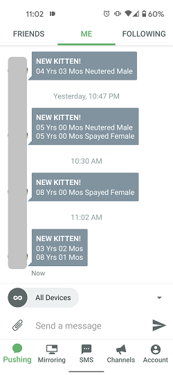

# Cat Finder  

## What is this project about
This project is intended to get the latest info of new cats posted on Animal Rescue League and notify the user by sending out correspondent messages.  

## Why this project
Been always wanted to adopt a cat, and by the time I finally made the decision and finished cat proofing my apartment, I chose the Animal Rescue League of Boston. However, because of the pendemic, people seem to be more enthusastic about adopting pets, especially cats, during the time of qurantine. Whenver I see a new post of a new kitten on the shelter's website, there is always someone in front of me to submit the application. Who can say no those adorable fluffy balls?  
So, in order to not wasting time manually refreshing their websites and still be norified whenever there is a new kitten coming out, I made this Python project.  
* Webscraping with BeautifulSoup 
* Notify through Pushbullet 
* Run the program automatically with Windows Task Schedular or other cloud-based servers.   

## How to use it
If you want to use this project to get the latest info of any new pets posted on Animal Rescue League, you may need to modify the following:  
* Change the base URL to the specific Animal Rescue League division, and omit the page number in the URL 
* You can find your own Pushbullet Token in the [settings](https://www.pushbullet.com/#settings). 
* You can also add filters, and only get notified when the new pets meet certain creteria (color, sex, etc.).  
  

## Check out the website of [Animal Rescue League of Boston](https://www.arlboston.org/)  

## Meet Cumin!

